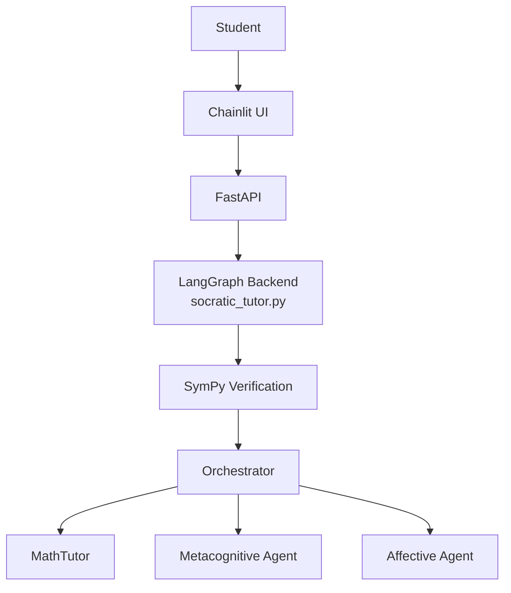
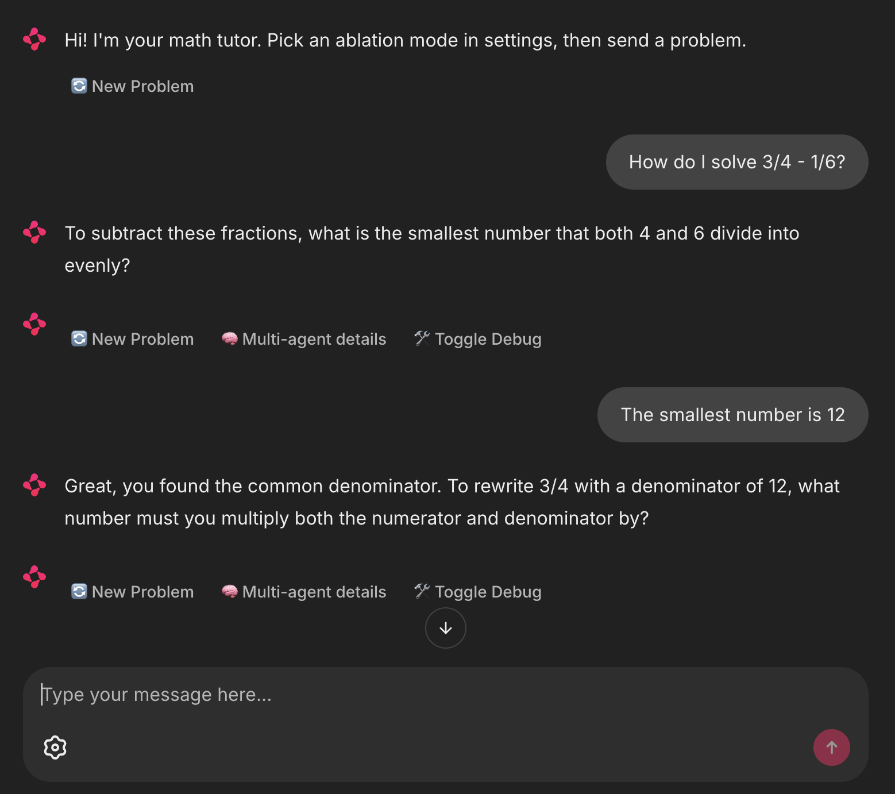
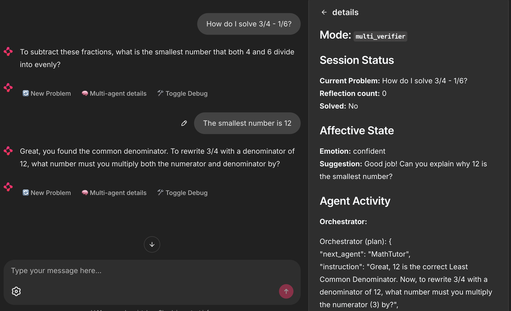
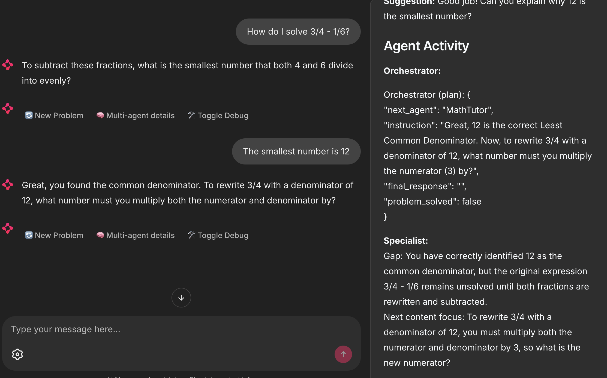
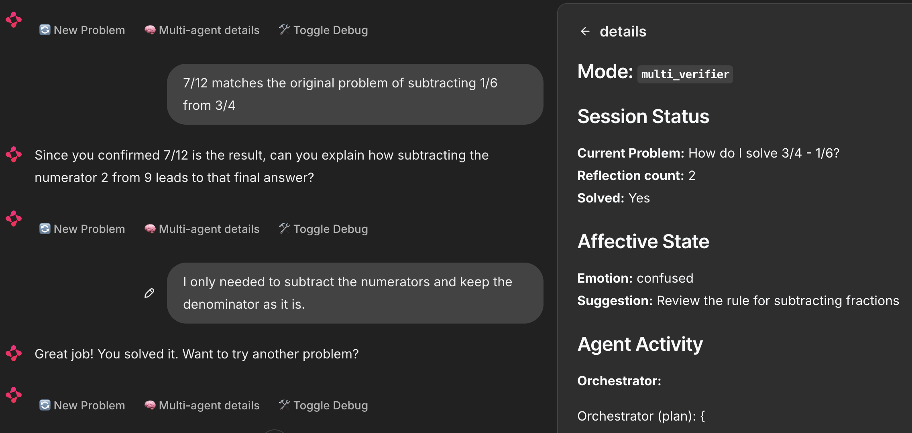

# Multi-Agent Socratic Tutoring System

Full-stack multi-agent math tutoring system built with LangGraph.  
It combines Socratic dialogue, metacognitive reflection, and lightweight affective scaffolding.

## System architecture 


### Interface

*Main tutoring interface*



*Session side panel*


*Session close*

## Demo Video

## Documentation

Full project documentation:  
https://11awrence.github.io/socratic-tutoring-system/

## Current Version

- `socratic_tutor.py` — core LangGraph multi-agent backend
- `api.py` — FastAPI layer
- `chainlit.py` — Chainlit frontend

## Features

- Multi-agent architecture (Orchestrator, MathTutor, Metacognitive, Affective)
- Socratic step-by-step guidance instead of direct answers
- Metacognitive reflection after problem solving
- Affective signal that influences tutoring tone
- Clean separation between reasoning backend and UI

## Example Conversation


## Installation
 
```bash
git clone https://github.com/11awrence/socratic-tutoring-system.git
cd socratic-tutoring-system
 
python -m venv .venv
source .venv/bin/activate          # Windows: .venv\Scripts\activate
 
pip install -r requirements.txt
```
### Model Configuration
 
This project uses local MLX models and currently requires Apple Silicon.
 
1. Copy the example environment file:
 
```bash
cp .env.example .env
```
 
2. Edit `.env` and set the paths to your local models:
 
```bash
ORCHESTRATOR_MODEL=/path/to/your/qwen3.5-122b
AFFECTIVE_MODEL=/path/to/your/qwen2.5-3b
TEMPERATURE=0.7
TOP_P=0.9
```
 
- `ORCHESTRATOR_MODEL` is used by the Orchestrator, MathTutor, and Metacognitive agents.
- `AFFECTIVE_MODEL` is a smaller model used only for the affective signal.
- You may optionally override `MATH_TUTOR_MODEL` or `METACOGNITIVE_MODEL` if you want different models for those roles.
 
The system will refuse to start if `ORCHESTRATOR_MODEL` or `AFFECTIVE_MODEL` are not set.

### Hardware Notes
 
- Apple Silicon required (MLX).
- The 122B-class model needs substantial unified memory (128 GB recommended).
- The 3B affective model is lightweight.

## Running the System
You need two terminals:
 
**Terminal 1 – Start the API**
```bash
uvicorn api:app --reload --port 8000
```
 
**Terminal 2 – Start the Chainlit frontend**
```bash
chainlit run chainlit.py --port 8001
```
 
Then open the URL shown by Chainlit (usually http://localhost:8001).

## Status
This version focuses on a working prompt-driven multi-agent tutoring loop with a usable UI.
It demonstrates both the strengths and the current limits of relying primarily on prompting for agent coordination and state tracking.

## Future Work
- Stronger deterministic routing (less reliance on LLM decisions)
- Better progress / current-step tracking
- Improved affective adaptation
- Optional multimodal inputs

## Troubleshooting

> Original project concept and system design by L.Lawrence. Implementation built from scratch with AI-assisted development for coding support, debugging, and iteration.