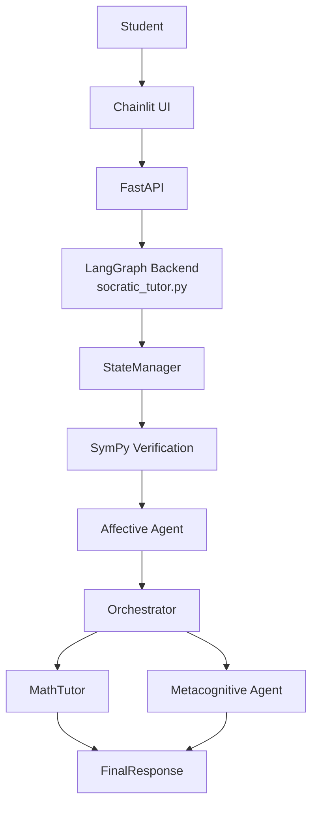

# Multi-Agent Socratic Tutoring System

Prompt-driven multi-agent Socratic math tutor (LangGraph + FastAPI + Chainlit),
with a SymPy verification node and a single-agent baseline for ablation.

**Question:** How far can multi-agent tutoring go when most coordination still lives in prompts?

## Ablation
Three modes in the UI / `.env` (`ABLATION_MODE`):

| Mode | What runs |
|---|---|
| `single` | one compound prompt, no graph, no verifier |
| `multi` | full graph, verifier skipped |
| `multi_verifier` | full graph + SymPy node (default) |

Scripted personas + scored results: [`eval/`](eval/)  
Write-up: [`docs/report.pdf`](docs/report.pdf)  
Docs site: https://11awrence.github.io/socratic-tutoring-system/

Main finding: multi beats single on error recall, guidance, meta timing, and close;
single stays more Socratic and regresses less. `multi` ≈ `multi_verifier` because
target parsing often fails.

## Quick start
Apple Silicon + local MLX models. Details: [Setup](docs/setup.md).

```bash
cp .env.example .env   # set ORCHESTRATOR_MODEL and AFFECTIVE_MODEL
pip install -r requirements.txt
# two terminals:
uvicorn api:app --port 8000
chainlit run chainlit.py --port 8001
```

`TEMPERATURE=0` and `SEED=42`match the reported runs. `PROVIDER=openai` is a stub.

### Hardware Notes

- Apple Silicon required for MLX.
- The 122B-class model needs substantial unified memory (128 GB recommended).

## System architecture 


### Interface

*Main tutoring interface*

## Demo
https://youtu.be/M_07Nq6jYNc

## Repo
- `socratic_tutor.py` — graph, agents, verifier, logging
- `api.py` — FastAPI layer
- `chainlit.py` — Chainlit frontend
- `eval/` — run1 traces, scored CSVs, notebook

## Status
A working demo with prompt-heavy control. Verifier layer is in the graph but not a reliable judge yet.

> Original project concept and system design by L.Lawrence. Implementation built from scratch with AI-assisted development for coding support, debugging, and iteration.