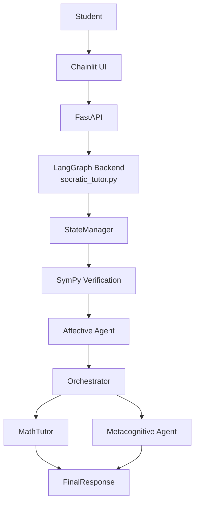

# Architecture

## System overview
The system is organised as a multi-agent tutoring pipeline built with LangGraph.  
A lightweight FastAPI layer exposes the backend, while a Chainlit frontend handles interaction and visualisation.

At the system level:

At the Langgraph level:

**Student message → State update & verification signal → Affective signal → Orchestrator decision → Specialist response → Final polished message**

The design deliberately keeps most coordination inside prompts and a relatively simple graph structure, rather than a heavy deterministic controller.

Ablation mode:
- `multi_verifier` aligns fully with the system described above.
- `multi` skips the SymPy verification layer.
- `single` bypasses the graph and uses one compound prompt.

## Models
The current prototype uses local MLX models:
- Orchestrator / MathTutor / Metacognitive: [Qwen3.5-122B-A10B-4bit](https://huggingface.co/mlx-community/Qwen3.5-122B-A10B-4bit)
- Affective: [Qwen2.5-3B](https://huggingface.co/Qwen/Qwen2.5-3B-Instruct)

## Agents
### Orchestrating Agent
The central decision-making agent. It:
- Tracks the current problem and recent history
- Decides whether the next step should be tutoring or reflection
- Writes a focused instruction for the chosen agent
- Judges when the problem appears solved

In practice, the Orchestrator mainly routes between continued tutoring and post-solution reflection. Free mid-process calls to the Metacognitive agent were restricted for stability reasons (see below).

### Mathematical Reasoning Agent
The main Socratic tutoring agent. It:
- Receives a narrow instruction from the Orchestrator
- Produces the next micro-step or guiding question
- Avoids giving full solutions

### Metacognitive Support Agent
This agent is intentionally constrained. It is triggered **only after the problem is considered solved**. It:
- Prompts the student to reflect on their reasoning
- Focuses on process rather than the final answer
- Runs for up to two reflection turns before the session is forced to close

This restriction was introduced because allowing the Orchestrating Agent to call Metacognitive  Support Agent freely led to early interruptions, incomplete reflection loops, and unstable session endings. Keeping metacognitive support post-solution made the prototype more reliable, at the cost of less flexible mid-process reflection.

### Affective
A lightweight agent that:
- Infers a simple emotional state from the student’s message
- Produces a short suggestion that can influence tutoring tone
- Remains advisory rather than controlling the main dialogue

## LangGraph flow
The graph follows a recurring loop:

1. **State Manager** — detects new problems and resets relevant state
2. **Verification** — runs SymPy checks and provides Orchestrator structured mathematical signals
3. **Affective** — updates emotion + suggestion
4. **Orchestrator** — decides next action
5. **Specialist**
   - **MathTutor** while the problem is unsolved
   - **Metacognitive** only after the problem is considered solved
6. **Final Response** — polishes the specialist output into a student-facing message

Routing remains largely prompt-driven. The main hard constraint is that metacognitive reflection is delayed until a solve is detected, which stabilised session behaviour in practice.

## Backend vs Frontend separation

- **Backend** (`socratic_tutor.py`)  
  Contains the SymPy verification, LangGraph definition, agents, state logic, and session logging function.

- **API layer** (`api.py`)  
  Exposes a `/turn` endpoint so the reasoning system can be called independently of any UI.

- **Frontend** (`chainlit.py`)  
  Handles the chat interface, mode chooser for ablation, "New Problem" reset, and the side panel that surfaces agent activity (triggered by "Multi-agent details").

This separation makes the tutoring logic reusable and easier to inspect.